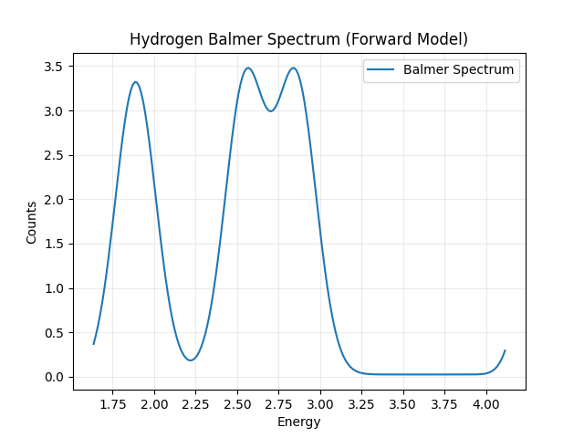
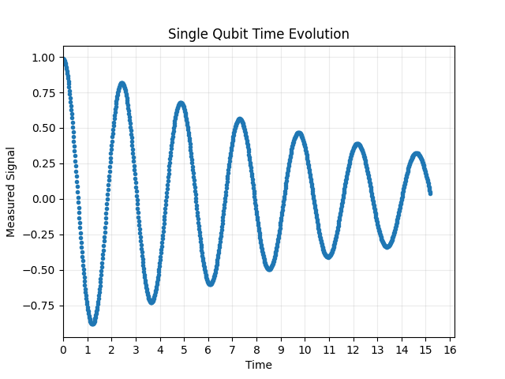
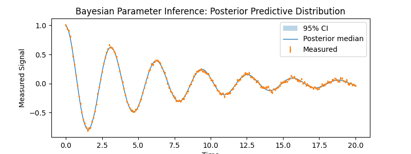
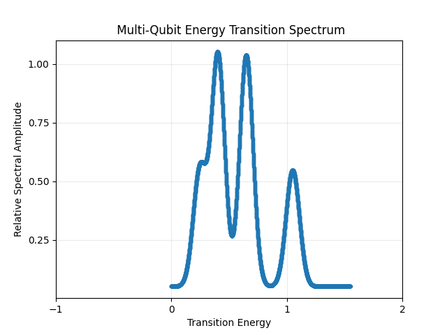
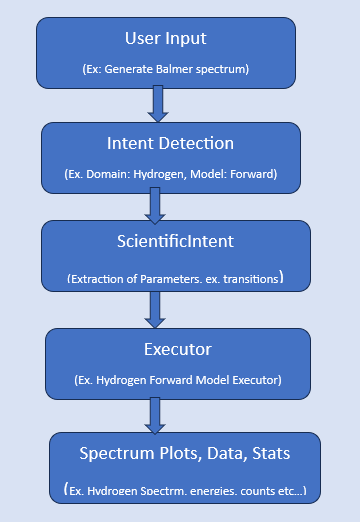

  ## A Neural–Bayesian Framework for Atomic Spectra and Quantum State Modelling with a Natural Language Interface

## Overview

 This project presents a unified Neural–Bayesian computational framework for forward modelling and inverse inference of atomic spectral systems and quantum qubit systems.

## Highlights

- Natural language scientific queries  
- Bayesian parameter inference  
- Hydrogen spectroscopy  
- Single-qubit simulation  
- Multi-qubit simulation


  ## Example Outputs
  <p align="center">
  
</p> 
  <p align="center"><small><b>Figure 1.</b> User input: "Generate Balmer Spectrum"</small></p>

  <br><br>
  
<p align="center">
  
</p>
  <p align="center"><small><b>Figure 2.</b> User input: "Simulate single qubit evolution"</small></p>
  <br><br>

  <p align="center">
  
</p>
    <p align="center"><small><b>Figure 3.</b> User input: "Please give single qubit evolution parameters from file synthetic_single_qubit.npz"</small></p>
  <br><br>

  <p align="center">
  
</p>
    <p align="center"><small><b>Figure 4.</b> User input: "Please show me two qubit evolution dynamics"</small></p>
  <br><br>

  <p align="center">
  
</p>
<p align="center"><small><b>Figure 5.</b> NLP to Science Pipeline</small></p>
  <br><br>
The framework combines:

- Physics-based forward simulation

- Bayesian parameter estimation

- Neural natural language processing

- Modular scientific software architecture

Users interact with the system through natural language queries, which are automatically interpreted and routed to the appropriate scientific computation pipeline.

---

## Motivation

Scientific modelling workflows often require domain expertise, custom scripting, and multiple disconnected tools.

This framework explores a unified approach in which:

1. A user specifies a scientific task using natural language.

2. A neural intent detection system identifies the requested operation.

3. Structured parameters are extracted.

4. Physics-based forward models or Bayesian inference engines are executed.

5. Results are returned as numerical outputs, statistical summaries, and visualizations.

The objective is to bridge modern AI techniques with computational physics and quantum modelling workflows.

---

## Mathematical Formulation

The framework supports two primary computational tasks.

### Forward Modelling

Given a parameter vector

$[ 
\theta 
]$

the system evaluates a physics-based model

$[ 
D_{\text{pred}} = f(\theta) 
]$

to generate synthetic spectra, quantum evolution curves, or measurement probabilities.

### Bayesian Inference

Given observed data (D), the framework estimates model parameters through posterior inference:

$$
p(\theta \mid D) \propto p(D \mid \theta) \, p(\theta)
$$

where

- $(p(\theta))$ is the prior distribution,

- $(p(D\mid\theta))$ is the likelihood,

- $(p(\theta\mid D))$ is the posterior distribution.

Inference is performed using Markov Chain Monte Carlo (MCMC) methods.

---

## Current Capabilities

### Atomic Spectroscopy

- Generate Hydrogen spectra

- Simulate spectral transitions

- Infer spectral parameters from observed data

### Single-Qubit Systems

- Simulate single-qubit evolution

- Generate measurement probabilities

- Infer qubit parameters from observed data

### Multi-Qubit Systems

- Simulate multi-qubit dynamics

- Support time-domain evolution

- Support frequency-domain modelling

- Infer multi-qubit parameters from observed data

---

## Natural Language Interface

Users may interact with the framework using free-form text.

### Example Queries

```text
Generate Balmer spectrum

Generate single qubit evolution

Generate multi qubit frequency spectrum

Infer parameters from hydrogen file sample.npz

Infer parameters from single qubit file data.npz

Infer parameters from multi qubit file experiment.npz
```

The system automatically identifies:

- Scientific domain

- Requested operation

- Relevant parameters

and routes execution through the corresponding computational pipeline.

---

## Software Architecture

```text
User Query
    |
    v
NLP Parser
    |
    v
Intent Engine
    |
    v
ScientificIntent
    |
    v
IntentExecutionBridge
    |
    v
Domain Executor
    |
    +----------------+
    |                |
    v                v
Forward Model   Bayesian Inference
```

---

## Core Components

### Neural Language Layer

- Intent detection

- Slot extraction

- Query normalization

### Scientific Execution Layer

- ScientificIntent contract

- Executor registry

- Domain-specific executors

### Physics Layer

- Hydrogen spectral modelling

- Single-qubit simulation

- Multi-qubit simulation

### Bayesian Layer

- Likelihood evaluation

- MCMC sampling

- Posterior estimation

---

## Example Outputs

The framework can generate:

- Hydrogen spectra

- Time-evolution curves

- Frequency spectra

- Posterior distributions

- Parameter estimates

- Confidence intervals

- Diagnostic statistics

Example plots and screenshots are provided in the documentation.

---

## Installation

```bash
git clone <repository_url>

cd scientific-ai-framework

pip install -r requirements.txt
```

---

## Model Checkpoint

The trained ScientificIntent model checkpoint is distributed separately through GitHub Releases.

See UserGuide.md for installation and setup instructions.

## Running

```bash
python main.py
```

---

## Project Status

Current Release:

**Version 0.1-alpha**

Implemented Domains:

- Hydrogen Spectroscopy

- Single-Qubit Systems

- Multi-Qubit Systems

Implemented Operations:

- Forward Modelling

- Bayesian Inference

- Natural Language Query Processing

The framework is under active development and additional scientific domains will be added in future releases.

## Planned Domains

- X-ray spectroscopy
- Nuclear physics models
- Additional quantum systems
- Topological Quantum Systems (Chern Numbers and Topological Invariants)
- Advanced neural intent models

---

## Author

Kiran Kumar Thota

Ph.D. Physical Sciences

Interests:

- Scientific AI

- Bayesian Inference

- Quantum Systems

- Atomic Spectroscopy

- Machine Learning for Physics

- Scientific Software Development
